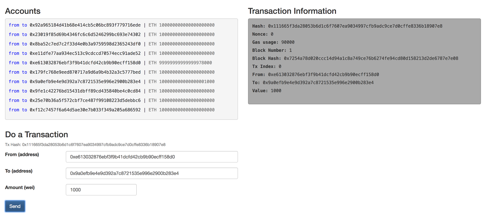

## Simple ETH transfers

We'll build a simple web app to send ether from one account to another. 


> You should have `testrpc` already installed. No?
We strongly recommend not to skip steps on this guide to make the most of it.
Learn about [properly setting up a test environment here](test-environment.md).
If you're only interested in interacting with ether on the web without building
smart contracts, you can keep reading below – just run `npm install -g ethereumjs-testrpc`.

Go into a new folder and run a `testrpc` node.
```
mkdir webapp
cd webapp
testrpc
```

Running `testrpc` will create 10 addresses with fake ether by default. You make a custom 
initialization by [following the documentation](https://github.com/trufflesuite/ganache-cli#usage).
It’s important to mention that the `testrpc` state is volatile, that is every time you
close it, the state of your node and accounts will be cleared.

[web3.js](https://github.com/ethereum/wiki/wiki/JavaScript-API) is a a
JavaScript library that implements the Ethereum JSON RPC. That is, the protocol
that we will use to talk to an Ethereum node (in this case, testrpc). To
install it, just run:

```
npm install -g web3@0.20.1
```

For this exercise, make sure to install a 0.20.x version, not the 1.0.0 beta.

You need to connect `web3` with your local `testrpc` node by asking `web3` to use 
a `localhost` provider. Let’s open a node console and input following lines:

```
Web3 = require('web3')
provider = new Web3.providers.HttpProvider("http://localhost:8545")
web3 = new Web3(provider)
```

Please note that we are using the default `testrpc` port (8545), if you set
another one, remember to change the provider URL too. Once you have your `web3`
instance, start by getting the list of accounts you have in your Ethereum node,
with their respective balance, by running the following:

```
web3.eth.accounts.forEach(account => {
  balance = web3.eth.getBalance(account);
  console.log(balance);
})
```

> You probably noticed that the output is not exactly a list of numbers, that’s
because Web3 uses BigNumber objects for number values, since JavaScript is not
able to handle big numbers correctly. You can read more about this 
[here](https://github.com/ethereum/wiki/wiki/JavaScript-API#a-note-on-big-numbers-in-web3js).

> You should also know that these balances are not expressed in ETH, but in
wei, where 1 ETH = 10¹⁸ wei. Read the Ethereum documentation to learn more
about ETH standard units.

Let’s try to send ETH between two accounts.  Just type `web3.eth.accounts` and pick two of those. 
Then you can use the `sendTransaction` method:
```
from = web3.eth.accounts[0]
to = web3.eth.accounts[1]
transaction = { from: from, to: to, value: 100000 }
transactionHash = web3.eth.sendTransaction(transaction)
```

That output is the transaction hash, and you can get the transaction
information with the method `web3.eth.getTransaction(transactionHash)`

You may also want to check that the balances of the accounts that you used have
changed. You can validate that with the following commands:

```
web3.eth.accounts.forEach(account => {
  balance = web3.eth.getBalance(account);
  console.log(balance);
})
```

We built a simple UI using HTML and jQuery with a little bit of Bootstrap
just to make it pretty. You can take a look at it in 
[this repo](https://github.com/facuspagnuolo/ethereum-spiking/tree/master/1-interacting-with-the-blockchain). 
This is what we call a DApp, or decentralized application: part of the backend code runs on a 
decentralized peer-to-peer network (in this case, the Ethereum blockchain).



You will find an `index.html` file for the UI, and an `app.js` file hosting the
interaction with the Ethereum node – basically what we described above
in addition to jQuery callbacks to populate the UI.

## Crowdfunding Dapp with smart contracts

Projects do a crowdfunding campaign in order to raise funds to carry out a
project. You can issue a digital asset related to your project and immediately
sell it to anyone in the world, for almost zero cost. This is what we call an
Initial Coin Offering (ICO).

To carry out an ICO with smart contracts, you just need to implement the logic
that makes your digital assets tradable and valuable. Sounds great, doesn’t it?
These are Ethereum tokens. A token is a digital asset within the Ethereum
ecosystem.

Let’s try to analyze all these ideas through an example.

Suppose you have health food company that wants to launch a new brand. You
decide to conduct an ICO to raise 20,000 ETH. You offer 10 tokens in return for
every 1 ETH you collect, promising that contributors will be able to buy food
at your stores with the tokens. To do this, you can develop a token smart
contract that stores the proportional amount of tokens for each contributor.

Now, let’s suppose you raised that money, developed your project, and opened
your first store. Then, you decide to sell each salad for 1 token. After a
week, it turns out that you have an increasing demand, but given that the
supply of salads is limited, your customers notice and start trading your
tokens as an asset, raising their market value.

This process has been carried out in real life, given Ethereum allows virtually
anyone to create their own tradeable, digital asset.

### The smart contract

Look at the following code that could power a crowdfunding campaign.
> Please know that this examples are just for learning purposes, you should not use them in production.

```
pragma solidity ^0.4.0;
contract MyToken {
 address public creator;
 uint256 public totalSupply;
 mapping (address => uint256) public balances;
function MyToken() public {
   creator = msg.sender;
   totalSupply = 10000;
   balances[creator] = totalSupply;
}
 function balanceOf(address owner) public constant returns(uint256){
   return balances[owner];
 }
 
 function sendTokens(address receiver, uint256 amount) 
 public returns(bool){
   address owner = msg.sender;
   
   require(amount > 0);
   require(balances[owner] >= amount);
   
   balances[owner] -= amount;
   balances[receiver] += amount;
   return true;
 }
}
```

Let's walk through the code.  The `pragma` keyword tells which version of
Solidity you are using for your source code. Then, it begins the contract
definition initiating with its name, in this case, MyToken. Next, you will find
three variables:

- `creator` is an address variable to store the owner of the contract.
- `totalSupply` is an 256 bit unsigned int to store the amount of tokens willing to be shared with the investors
- `balances` is a map from addresses to unsigned ints where the balances of each investor will be stored

Afterwards, you will find the constructor function. As you can see, it is a
function with the same name of the contract, and it will be called only once
every time a new instance of the contract is deployed to the network. Here is
where the owner of the contract gets stored. Since every function call is a
transaction, it is possible to know the owner of the contract using the sender
of the transaction, that is msg.sender. Finally, the contract defines a total
supply of 10,000 tokens, and assigns it to the token creator.

The next function is an easy one: balanceOf simply tells you the balance of an
address received by parameter. Maybe you are wondering what the constant
keyword means. Well that’s because Solidity has two kinds of functions,
constants and non-constant.

Non-constant functions perform state changes. On the other hand, constant
functions are read only once, meaning those don’t perform any state changes,
they just read data. Actually, there are two types of constant functions:

- view declared functions promise not to modify the state (alias to constant)
- pure declared functions promise not to read from or modify the state

The last function is the one that allows us to trade tokens between addresses.
This is a non-constant or transactional function because you will be changing
balances. It expects the receiver’s address and the amount of tokens you want
to transfer by parameter, and it returns a boolean representing whether the
transaction has been successfully executed or not. You can skip the first line,
it is just keeping the sender of the function in the owner variable.

Next, you will find two preconditions:
```
...
require(amount > 0);
require(balances[owner] >= amount);
...
```

require is one of the methods that you can use to check conditions or make
validations. It will eval a condition and revert in case that condition is not
met. So, in this case, it is requiring that the amount of tokens to be
transferred is greater than zero, and ensuring the sender has enough balance to
send that amount.

Finally, you are subtracting the required amount of tokens from the owner’s
balance and adding it to the receiver’s balance:

```
...
 balances[owner] -= amount;
 balances[receiver] += amount;
 return true;
}
```

### Deploying the smart contract
Now, let’s start playing with our contract! You will need to deploy our
contract to the network first. To do that, you will use a Solidity compiler for
node.js called solc. You can install it by running:

```
npm install -g solc
```

Create a file called `MyToken.sol`, and paste the contract code into it. Then,
open a terminal console in the same dir where you placed that file. First,
compile it running the following command:

```
solcjs MyToken.sol --bin
```

The compiler will create a MyToken_sol_MyToken.bin file with the output. You
can check that file contains just bytecode. Next, you will need to use solc to
build the ABI (Application Binary Interface), an interface or template of your
contract that tells you the available methods of it. This is the point of
contact with Web3. Your just need to run:

```
solcjs MyToken.sol --abi
```

Then, you will see a new file called MyToken_sol_MyToken.abi with a JSON
content that bassically defines the interface of your contract.

Finally you just need to deploy your contract from a node.js console using
testrpc running in background. Once you have done that, let’s initialize web3:

```
//instance web3
Web3 = require('web3')
provider = new Web3.providers.HttpProvider("http://localhost:8545")
web3 = new Web3(provider)
```

Web3 gives you the possibility to parse your contract ABI and provide a
JavaScript API to interact with it. Then, you just need the bytecode to deploy
a new instance of that contract to testrpc. Please follow the next commands:

```
// load files
myTokenABIFile = fs.readFileSync('MyToken_sol_MyToken.abi')
myTokenABI  = JSON.parse(myTokenABIFile.toString())
myTokenBINFile = fs.readFileSync('MyToken_sol_MyToken.bin')
myTokenByteCode = myTokenBINFile.toString()
//deploy
account = web3.eth.accounts[0]
MyTokenContract = web3.eth.contract(myTokenABI)
contractData = { data: myTokenByteCode, from: account, gas: 999999 }
deployedContract = MyTokenContract.new(contractData)
```

Finally, you can check the address of your new deployed contract by calling
deployedContract.address. Please save that address because you will need it to
interact with your contract.

### Interacting with web3

Let’s begin by searching the token balances of your testrpc accounts. To do so,
you will need to access the instance of your deployed contract first:

```
contractAddress = deployedContract.address
instance = MyTokenContract.at(contractAddress)
web3.eth.accounts.forEach(address => {
 tokens = instance.balanceOf.call(address)
 console.log(address + ": " + tokens)
})
```

You will notice that your first account is the one that owns the total supply,
which is expected. Great! Next, let’s transfer some of those tokens to another
account:

```
// send tokens
amount = 10
from = web3.eth.accounts[0]
to = web3.eth.accounts[1]
transactionHash = instance.sendTokens(to, amount, { from: from })
// checkout balances again
web3.eth.accounts.forEach(address => {
 tokens = instance.balanceOf.call(address)
 console.log(address + ": " + tokens)
})
```

You should see that now the second address has 10 tokens! And you can also
search for the transaction information as you did in the first part of this
guide:

```
web3.eth.getTransaction(transactionHash)
```

I also built a simple UI for this mini DApp, you can 
[find it here](https://github.com/facuspagnuolo/ethereum-spiking/tree/master/2-interacting-with-a-contract). 
You will see a MyToken.json file that holds the ABI of our contract. I just pasted the
content of the ABI generated by the solidity compiler into it. You will also
find an app.js file similar to the previous app, but including the logic that I
just showed you to send tokens and detailed token balances of your accounts.


> The token described in this article is not ERC20 compliant to reduce the new term overload. If you don’t know what an ERC20 compliant token is, we’ll explain it in the next article.
